# BULK PUBLISHING CONTENSTACK EXTENSION APP

This application is based on the following boilerplate example:

See the [Boilerplate App]("https://github.com/contentstack/marketplace-app-boilerplate") for further details.

## Application(s) Setup

This application consists of two parts, a React application available in the `app` folder, as well as an `api` application based on express.

In both cases these are standard create-react-app and express-based api implementation and you should be familiar with both in order to be able to use this as a reference and implement further functionality.

Here you can find more information about [React]("https://reactjs.org/") and [Express]("https://expressjs.com/").

Within both folders you will need to install the dependencies using your preferred package manager. In this case we will use `yarn`.
Simply run `yarn` within each folder.

Alternatively you can build both applications and deploy them to a server of your choice.

Each application rely on different configuration values that are managed differently due to the different architecture of each application. The following sections describe where/how to manage those configuration values.

### API Configuration

The API application uses `.env` for its configuration and all you need to know is to modify yours according to your needs:

#### `~/api/.env`

```properties
# Port in which the api will run
PORT=8080

#OAuth Client ID
CS_CLIENT_ID=ZX14kOakcbf1xuRc

#OAuth Client Secret
CS_CLIENT_SECRET=RBJlSA9mBB0OKodkb1fbC6FaSL5fkesu

#OAuth Redirect URI
CS_REDIRECT_URI=http://localhost:3000/callback

```

### APP Configuration

The APP application uses constant javascript variables that in case of needing changing, would need to be modified prior to build/run. This app also relies on an `.env` file for encrypting the local storage values (See [react-secure-storage](https://www.npmjs.com/package/react-secure-storage) for more details). Those constants can be found in the following files:

#### `~/app/src/hooks/oauth/constants.ts`

```typescript
// This file contains the constants used in the OAuth flow
// You can change the values of the constants to match your environment
export const HOST = "http://localhost:8080"; // The host of your API application
export const CONTENTSTACK_HOST = "https://api.contentstack.io/"; // The host of the Contentstack API
export const EXCHANGE_CODE_URL = `/api/exchange-code`; // The path of the endpoint that exchanges the code for an access token
export const REFRESH_TOKEN_URL = `/api/refresh-token`; // The path of the endpoint that refreshes the access token
```

#### `~/app/src/components/bulk-publishing-sidebar/constants.ts`

```typescript
//Other configuration values
const MAX_BULK_PUBLISHING_REQUESTS = 10; // The maximum number of bulk publishing requests that can be made
const MAX_ITEMS_PER_RELEASE = 500; // The maximum number of items that can be added to a release
const MAX_ENTRIES_ADDED_AT_ONCE = 25; // The maximum number of entries that can be added to a release at once
const MAX_RELEASE_NAME_LENGTH = 50; // The maximum length of a release name
```

#### `~/app/.env`

```properties
# Secure Local Storage Key
REACT_APP_SECURE_LOCAL_STORAGE_HASH_KEY=c8e4271f-4151-4ebb-99ae-317bf24ea1d7
```

Once you have your applications setup and running, it is time to configure the app in Contenstack. The following sections describe the process:

## Configuring the App in Contentstack

First you will need access to the `Developer Hub` and `Marketplace` functionality to proceed. You can check whether those options are enabled by clicking on the top-most left corner Contentstack icon and checking which options are available in the left navigation bar:

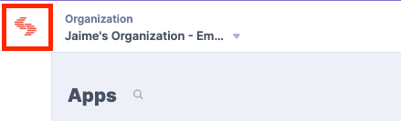

These are the options:


Next, navigate to `Developer Hub` and install your application following these steps:

1. Click the `+ New App` button on the top corner.
1. Fill in the form, making sure you choose `Stack App`.
1. Provide a `Name` and `Description` to your app.
   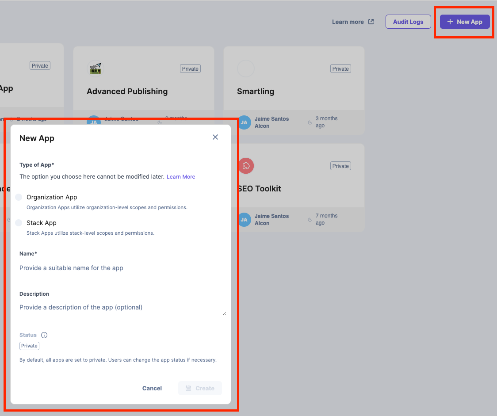
1. Then you will see the application details, such as its `APP UID`, which will be necessary for configuration later on.
   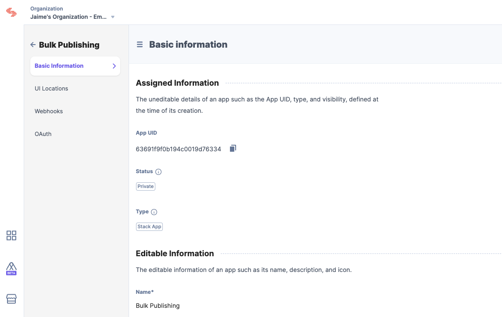
1. Next,navigate to the **UI Locations** section.
1. You will need configure two locations:
   1. `App Configuration`, pointing to your app configuration route in the app. e.g. `/app-configuration`.
      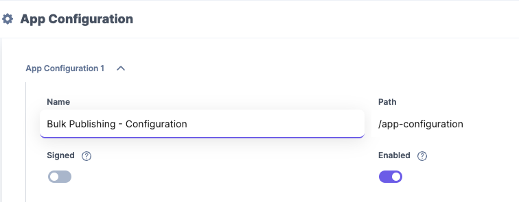
   1. `Entry Sidebar`, pointing to your app sidebar extension route in the app. e.g. `/buik-publishing`.
      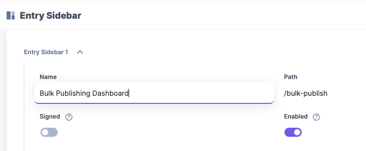
1. Next, you will enable and configure oAuth. Navigate to the **OAuth** section.
1. Copy your `Client ID` and `Client Secret` since you will need this for configuration when you install the app in any given stack.
1. Similarly, provide with a `Redirect URL`. This should match your app's callback host and route. e.g. `http://localhost:3000/callback`.
   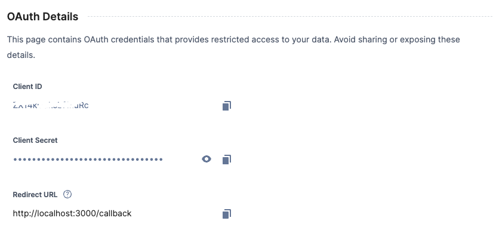
1. Next, you will need to provide the oAuth scopes so the application can execute the required actions within Contentstack. The application uses an oAuth `User Token`, so the actor of such actions can be tracked, as those actions enabled by the defined scopes here will be executed under the user's persona. You will need to click the `+ User Scopes` button to add the following scopes:
   1. `cm:entry:publish`
   1. `cm:asset:publish`
   1. `cm.environments.management:read`
   1. `cm.languages.management:read`
   1. `cm.bulk-operations:publish`
   1. `cm.bulk-operations:add-to-release`
   1. `cm.releases.management:read`
   1. `cm.releases.management:write`
   1. `cm.release:read`
   1. `cm.release:write`
   1. `cm.release:deploy`
      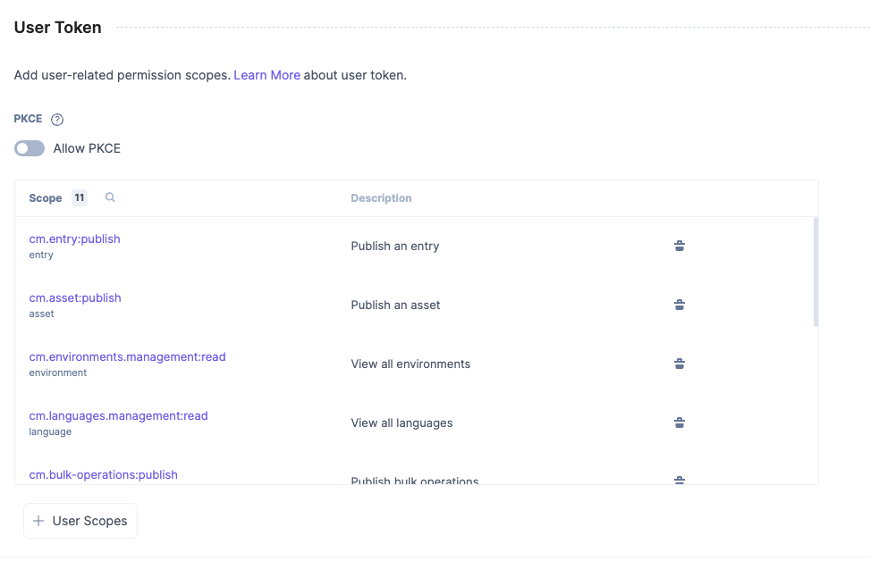
1. Once those scopes have been added you can hit `Save` and leave this page.
1. Next you will install the app in any given stack. Navigate back to `Developer Hub`.
1. Click on the app you just created.
1. On the top right corner click the `Install App` button.
1. Select the stack where you want to install the app and accept the terms and conditions.
   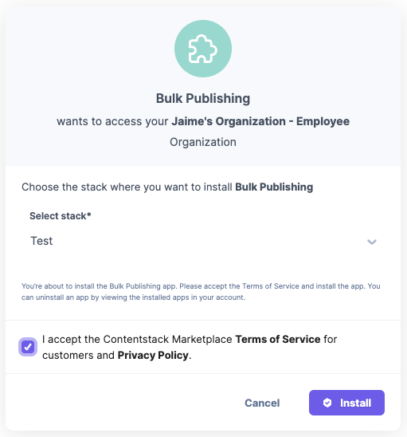
1. Click `Install`.
1. On the next screen you will need to provide with some json configuration as follows:
1. Once you have updated the values with the values you copied earlier, click `Update Configuration` and wait for the saving confirmation.

```json
{
  "name": "Bulk Publishing App",
  "apiKey": "${your_api_key},"
  "oauth": {
    "authorizeUrl": "https://app.contentstack.com/#!/apps/${appId}/authorize",
    "clientId": "${your_client_id}",
    "responseType": "code",
    "redirectUri": "${your_redirect_url}"
  }
}
```

**Note:** Make sure the following values are replaced: `${your_api_key}`, which can be retrieved form the `Tokens` section on your stack settings; `${appId}`, this is your unique application id; `${your_client_id}`, copied earlier. ; `${your_redirect_url}`, copied earlier, and make sure it matches your redirect url route in your app.

19. Next, click the `Save` button on the bottom right corner and, again, wait for confirmation.
1. Next, navigate to your stack, select an entry and click the widget icon in the right panel.
1. Select your application from the dropdown. Yo should see something like this:
   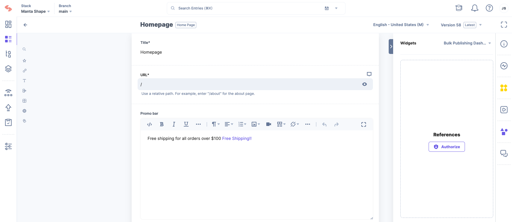
1. In the next section we describe the available functionality in the App.

### User Manual

The first time you access the app you will need to authorize it. Click the `Authorize` button and follow the prompts. You will need to select the appropriate Stack (in case you have access to more than one) and allow the app to perform the requested actions.

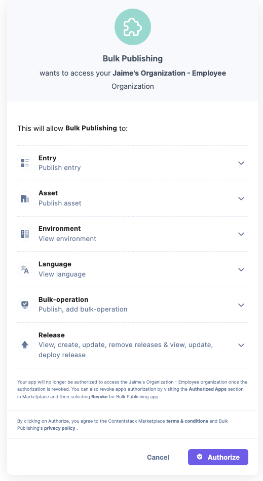

Once authorized you should see something similar to this:

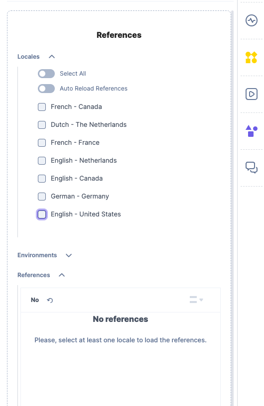

**Note:** if the `Authorize` button doesn't go away, simply close and reopen the sidebar.

In order for the app to allow you to publish, you will need to at least select one locale and one environment.
The app will save your selections when you leave the app, so the next time you come back the same selections are kept.
The app will `Auto Reload References` if such option is checked. This will reload the references table every time you check/uncheck a locale.
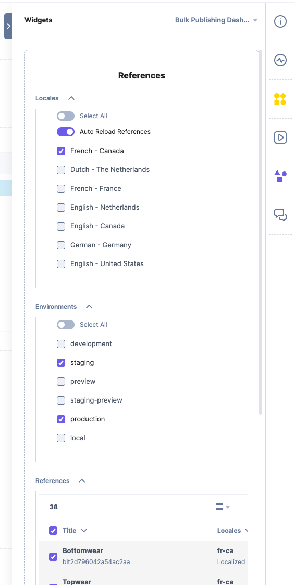

The app allows two types of publishing operations:

- `Publish`: this option will bulk-publish all the entries and assets in teh references table.
- `Release`: this option will create a release for each locale with the appropriate entries and assets for it. Additionally if the `Deploy Release` checkbox is checked, the releases will be automatically deployed.

And that's it for the most part. **Happy publishing!!** 🥳
